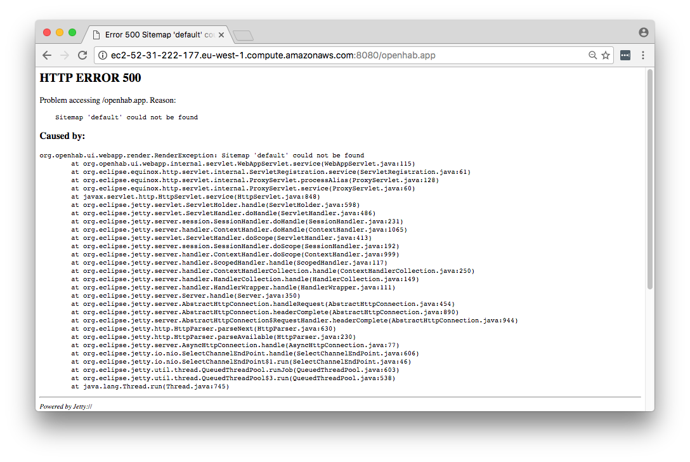

## Introduction

OpenHAB is open-source software which is designed to integrate the many third party pieces of hardware and allow a central place to automate and control them.

OpenHAB will be the center-piece of our architecture and all remote requests will go through it. All other instructions for specific parts will assume that you have followed this set of instructions.

## Pre-requisites

A computer on which to run openhab - it will need to be on 24/7 and be able to run linux. If you don' already own one, we recommend a raspberry pi v2.

If you are using a raspberry pi, you will need to install raspbian - this is the os that these instructions will assume. If you are using a different operating system, you may need to modify some of the commands - although any debian should be very similar.

## Skillsets needed

* basic computer knowledge (the ability to setup a pi, get it booted to an os and connected to the network)

## Warnings

## Common pitfalls

## Instructions

### Install Java ready for OpenHAB
1. sudo apt-get update
1. sudo apt-get install default-jre

### Tell apt to trust the OpenHAB Repos
1. wget -qO - 'https://bintray.com/user/downloadSubjectPublicKey?username=openhab' | sudo apt-key add -

### Add the OpenHAB Repo and install the runtime
1. echo "deb http://dl.bintray.com/openhab/apt-repo stable main" | sudo tee /etc/apt/sources.list.d/openhab.list
1. sudo apt-get update
1. sudo apt-get install openhab-runtime

### Start OpenHAB on boot
1. sudo systemctl enable openhab.service
1. sudo systemctl start openhab.service

At this point it may take a little while to start, after a couple of minutes, you should be able to point your browser at:

http://<rpi-ip>:8080/openhab.app

you should see a page that looks like:

This is fine for now, we will get to how sitemaps and items work when we start adding devices to OpenHAB
